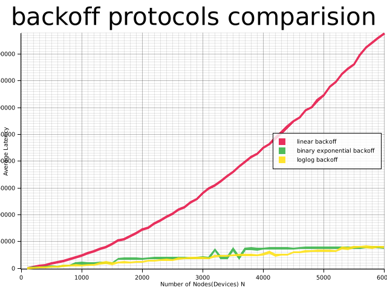

# Backoff Benchmark

A simulation of multiple backoff protocols for the purpose of comparing their latency. 

## About the Simulation code

For the simulation, Time is assumed to be discretized, i.e. divided into individual blocks,  called slots. A group of `n` contiguous slots compose a window (of size `n`). the slots currently available for use can exist in 3 states:
- `Empty` when no packet has arrived in this slot
- `Occupied` when exactly 1 packet has arrived in this slot
- `Collision` when more than one packet has arrived in this slot

Each Device has which needs to use the channel has one packet to transmit, and can exist in two states: 
- `Waiting` while packet is still waiting to Transmit
- `Succeeded` Once packet has been transmitted successfully

The number of devices per iteration of the simulation starts at 100, then increases by 100 until reaching 6000. During each iteration of the experiment, all devices pick a slot from the list of available slots. A transmission is successful if and only if a given slot is used by one device. if there are any devices that still are waiting to transmit, the window size is grown according to a growth rate. this growth rate is determined by the protocol in question.

## Protocols being benchmarked

the initial window size is the number of slots available for the first iteration.

the growth rate is copied from the source code

the type `BackoffFn` of the following closures is defined as:
```rust
type BackoffFn = fn(usize) -> usize;
```

### Linear Backoff 

initial window size: 2

growth rate: 
```rust
let linear_expansion: BackoffFn = |len: usize| len + 1;
```

### Binary Exponential Backoff (BEB)

initial window size: 2

growth rate: 
```rust
let binary_exponential_expansion: BackoffFn = |len: usize| len * 2;
```

### LogLog Backoff 

initial window size: 4

growth rate: 
```rust
 let loglog_expansion: BackoffFn =
        |len: usize| ((1. + (1. / (len as f64).log2().log2())) * len as f64).floor() as usize;

```

## Results

### Graph


### Interpretation

Overall the LogLog Backoff protocol tended to perform the best. There were periods or iterations where BEB performed better than LogLog, but it's performance was far less stable than LogLog. It appears near the end that the difference between BEB and LogLog sort of flattened out, and I'm curious how they might perform at higher iteration counts, but that is currently beyond the scope of this report. 

While BEB and LogLog were neck and neck, linear backoff performed undeniably the worst. This was because the channel capacity defined by the window size wasn't growing fast enough for the number of devices. The difficulty in avoiding a collision with a linear backoff remained pretty stable throughout the iteration of the simulation.

 Both LogLog and BEB were growing by orders of magnitude, meaning the probability of whatever devices still needing to transmit ther packets colliding in a given slot decreased drastically after each window growth. in the beginning a few got lucky, and shortly thereafter that the rest didn't need to. 
